.. _elements:

Elements
=========

.. only:: html

	**Table of content:**

	.. contents::
		:local:
		:depth: 1

.. _elements-general:

The configuration of the element can be set with a table when creating the element

::

	$form->add('my-element', 'text', array('placeholder' => 'My placeholder', 'class' => 'my-css-class'));
	
Or after instanciation 

::
	
	$form->add('my-element', 'text');
	$form->get('my-element')->with('placeholder', 'My placeholder');

.. _elements-button:

Button
------

Classic html button.

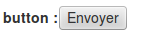
   
You can add a button like this

::

	$form->add('my-button', 'button', $configuration);

Available configuration

============  ===================================  ======================  ===================================================
Property      Description                          Default value           Example
============  ===================================  ======================  ===================================================
style         css style for the html tag                                   width: 150px;
disabled      true if the html field is disabled   false                   true or false
title         html tag title                                               my field title
custom        custom html attribute                                        customattr="customvalue"
class         css class for the html tag                                   big
errorclass    css class when there is an error                             error
label         label of the button                                          click me!
============  ===================================  ======================  ===================================================

.. _elements-captcha:

Captcha
-------

.. figure:: ../Images/captcha.png

You can add a captcha like this

::

	$form->add('my-captcha', 'captcha', $configuration);

Available configuration

============  ===================================  ======================  ===================================================
Property      Description                          Default value           Example
============  ===================================  ======================  ===================================================
placeholder   place holder for the html tag                                Enter the code
style         css style for the html tag                                   width: 150px;
disabled      true if the html field is disabled   false                   true or false
title         html tag title                                               my field title
custom        custom html attribute                                        customattr="customvalue"
class         css class for the html tag                                   big
errorclass    css class when there is an error                             error
errormessage  Message if the captcha is not valid  Captcha is not valid    Captcha is not valid
============  ===================================  ======================  ===================================================

.. _elements-checkbox:

Checkbox
--------

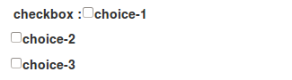
   
You can add a checkbox like this

::

	$form->add('my-checkbox', 'checkbox', $configuration);

Available configuration

============  ===================================  ======================  ===================================================
Property      Description                          Default value           Example
============  ===================================  ======================  ===================================================
style         css style for the html tag                                   width: 150px;
disabled      true if the html field is disabled   false                   true or false
title         html tag title                                               my field title
custom        custom html attribute                                        customattr="customvalue"
class         css class for the html tag                                   big
errorclass    css class when there is an error                             error
items         avalaible choice for checkbox                                array('1' => 'Item 1', '2' => 'Item 2');
============  ===================================  ======================  ===================================================

.. _elements-checksingle:

Checksingle
-----------

.. figure:: ../Images/checksingle.png
   
You can add a checksingle (yes/no choice) like this

::

	$form->add('istrue', 'checksingle', $configuration);

Available configuration

============  ===================================  ======================  ===================================================
Property      Description                          Default value           Example
============  ===================================  ======================  ===================================================
style         css style for the html tag                                   width: 150px;
disabled      true if the html field is disabled   false                   true or false
title         html tag title                                               my field title
custom        custom html attribute                                        customattr="customvalue"
class         css class for the html tag                                   big
errorclass    css class when there is an error                             error
============  ===================================  ======================  ===================================================

.. _elements-color:

Color
-----

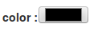

You can add a input color like this. Work only with html5 browser.

::

	$form->add('my-color-field', 'color', $configuration);

Available configuration

============  ===================================  ======================  ===================================================
Property      Description                          Default value           Example
============  ===================================  ======================  ===================================================
placeholder   place holder for the html tag                                my firstname
style         css style for the html tag                                   width: 150px;
disabled      true if the html field is disabled   false                   true or false
title         html tag title                                               my field title
custom        custom html attribute                                        customattr="customvalue"
class         css class for the html tag                                   big
errorclass    css class when there is an error                             error
============  ===================================  ======================  ===================================================

.. _elements-date:

Date
----

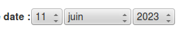

You can add a date like this.

::

	$form->add('birthdate', 'date', $configuration);

Available configuration

===================  =================================================  ======================  ===================================================
Property             Description                                        Default value           Example
===================  =================================================  ======================  ===================================================
class                css class for the html tag                                                 big
errorclass           css class when there is an error                                           error
format-display       sort field.d for day, m for month and y for year   dmy                     dmy, mdy, ymd 
year-minimum-limit   minimum availaible year                            1900                    1970
year-maximum-limit   maximum availaible year                            current year + 20       2050
format-output        format of the result                               timestamp               timestamp or format compatible with strftime
===================  =================================================  ======================  ===================================================

.. _elements-datepicker:

Datepicker
----------

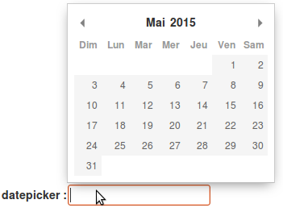

You can add a date picker like this.

::

	$form->add('startdate', 'datepicker', $configuration);

Available configuration

===================  ============================================================  ======================  ======================================================
Property             Description                                                    Default value           Example
===================  ============================================================  ======================  ======================================================
format               date format (http://momentjs.com/docs/#/displaying/format/)   D MMM YYYY              MMM D YYYY
placeholder          place holder for the html tag                                                         my firstname
style                css style for the html tag                                                            width: 150px;
disabled             true if the html field is disabled                            false                   true or false
title                html tag title                                                                        my field title
custom               custom html attribute                                                                 customattr="customvalue"
class                css class for the html tag                                                            big
errorclass           css class when there is an error                                                      error
firstDay             define which day of the week must be the first                0 (sunday)              1
landingDate          unix timestamp from which will be extracted year and month    current day             1484152522 (for january 2017)
                     that will be displayed upon user click
yearRange            array of start and end year to display in the year dropdown   [Year - 10, Year]       [2015, 2020]
minDate              unix timestamp for minimum date available                                             1583836842
maxDate              unix timestamp for maximum date available                                             1589107240
disableDays          array of array of specific days, days of week, months, years                          ['d' => [1, 2]] for mondays and tuesdays (0 = sunday)
				                                                                                           ['m' => [1, 4]] for february and may (0 = january)
				 																						   ['y' => [2015]] for year 2015
				                                                                                           ['ts' => [1582215827]] for specific days (20/02/2020)
===================  ============================================================  ======================  ======================================================

.. _elements-dropdown:

Dropdown
--------

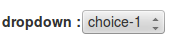

You can add a checkbox like this

::

	$form->add('my-dropdown', 'dropdown', $configuration);

Available configuration

============  ===================================  ======================  ===================================================
Property      Description                          Default value           Example
============  ===================================  ======================  ===================================================
style         css style for the html tag                                   width: 150px;
disabled      true if the html field is disabled   false                   true or false
title         html tag title                                               my field title
custom        custom html attribute                                        customattr="customvalue"
class         css class for the html tag                                   big
errorclass    css class when there is an error                             error
items         avalaible choice for checkbox                                array('1' => 'Item 1', '2' => 'Item 2') or a repository result ($this->myrepo->findAll())
============  ===================================  ======================  ===================================================

.. _elements-email:

Email
-----

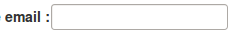

You can add a input email like this. Work only with html5 browser.

::

	$form->add('my-email', 'email', $configuration);

Available configuration

============  ===================================  ======================  ===================================================
Property      Description                          Default value           Example
============  ===================================  ======================  ===================================================
placeholder   place holder for the html tag                                my firstname
style         css style for the html tag                                   width: 150px;
disabled      true if the html field is disabled   false                   true or false
title         html tag title                                               my field title
custom        custom html attribute                                        customattr="customvalue"
class         css class for the html tag                                   big
errorclass    css class when there is an error                             error
============  ===================================  ======================  ===================================================

.. _elements-hidden:

hidden
------

You can add a input hidden like this.

::

	$form->add('my-hidden-field', 'hidden', $configuration);

Available configuration

============  ===================================  ======================  ===================================================
Property      Description                          Default value           Example
============  ===================================  ======================  ===================================================
placeholder   place holder for the html tag                                my firstname
style         css style for the html tag                                   width: 150px;
disabled      true if the html field is disabled   false                   true or false
title         html tag title                                               my field title
custom        custom html attribute                                        customattr="customvalue"
class         css class for the html tag                                   big
errorclass    css class when there is an error                             error
============  ===================================  ======================  ===================================================

.. _elements-number:

Number
------

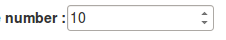

You can add a input hidden like this. Work only with html5 browser.

::

	$form->add('my-number-field', 'number', $configuration);

Available configuration

============  ===================================  ======================  ===================================================
Property      Description                          Default value           Example
============  ===================================  ======================  ===================================================
placeholder   place holder for the html tag                                my firstname
style         css style for the html tag                                   width: 150px;
disabled      true if the html field is disabled   false                   true or false
title         html tag title                                               my field title
custom        custom html attribute                                        customattr="customvalue"
class         css class for the html tag                                   big
errorclass    css class when there is an error                             error
min           minimum number                                               10
max           maximum number                                               100
step          increment step between each number   1                       10
============  ===================================  ======================  ===================================================

.. _elements-password:

Password
--------

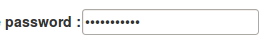

You can add a input password like this.

::

	$form->add('my-password', 'password', $configuration);

Available configuration

============  ===================================  ======================  ===================================================
Property      Description                          Default value           Example
============  ===================================  ======================  ===================================================
placeholder   place holder for the html tag                                my firstname
style         css style for the html tag                                   width: 150px;
disabled      true if the html field is disabled   false                   true or false
title         html tag title                                               my field title
custom        custom html attribute                                        customattr="customvalue"
class         css class for the html tag                                   big
errorclass    css class when there is an error                             error
encrypt       if true, password is encrypt         false                   true
fill_value    if true, add current value in html   false                   true
============  ===================================  ======================  ===================================================

.. _elements-radio:

Radio button
------------

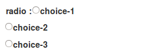

You can add a checkbox like this

::

	$form->add('my-radiobutton', 'radio', $configuration);

Available configuration

============  ===================================  ======================  ===================================================
Property      Description                          Default value           Example
============  ===================================  ======================  ===================================================
style         css style for the html tag                                   width: 150px;
disabled      true if the html field is disabled   false                   true or false
title         html tag title                                               my field title
custom        custom html attribute                                        customattr="customvalue"
class         css class for the html tag                                   big
errorclass    css class when there is an error                             error
items         avalaible choice for checkbox                                array('1' => 'Item 1', '2' => 'Item 2');
============  ===================================  ======================  ===================================================

.. _elements-range:

Range
-----

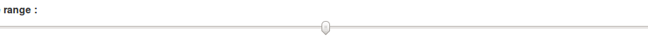

You can add a input hidden like this. Work only with html5 browser.

::

	$form->add('my-range-field', 'range', $configuration);

Available configuration

============  ===================================  ======================  ===================================================
Property      Description                          Default value           Example
============  ===================================  ======================  ===================================================
placeholder   place holder for the html tag                                my firstname
style         css style for the html tag                                   width: 150px;
disabled      true if the html field is disabled   false                   true or false
title         html tag title                                               my field title
custom        custom html attribute                                        customattr="customvalue"
class         css class for the html tag                                   big
errorclass    css class when there is an error                             error
min           minimum number                                               10
max           maximum number                                               100
step          increment step between each number   1                       10
============  ===================================  ======================  ===================================================

.. _elements-rating:

Radio button
------------

You can add a rating element like this

::

	$form->add('my-rating', 'rating', $configuration);

Available configuration

============  ===================================  ======================  ===================================================
Property      Description                          Default value           Example
============  ===================================  ======================  ===================================================
style         css style for the html tag                                   width: 150px;
disabled      true if the html field is disabled   false                   true or false
title         html tag title                                               my field title
custom        custom html attribute                                        customattr="customvalue"
class         css class for the html tag                                   big
errorclass    css class when there is an error                             error
min           score min                            1                       10
max           score max                            5                       50
step          step between score                   1                       2
label         label of item                        ★
============  ===================================  ======================  ===================================================

.. _elements-recaptcha:

ReCaptcha
---------

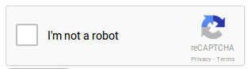
   
You can add a recaptcha like this

::

	$form->add('my-recaptcha', 'recaptcha', $configuration);

Available configuration

================  =============================================================================================================================================================================================================  ======================  ===================================================
Property          Description                                                                                                                                                                                                    Default value           Example
================  =============================================================================================================================================================================================================  ======================  ===================================================
publicKey         Your api public key (required)
privateKey        Your api private key (required)
onload            The name of your callback function to be executed once all the dependencies have loaded. (optional)
render            Whether to render the widget explicitly. Defaults to onload, which will render the widget in the first g-recaptcha tag it finds. (optional)
language          Forces the widget to render in a specific language. Auto-detects the user's language if unspecified. (optional) Language codes: https://developers.google.com/recaptcha/docs/language    en-GB
theme             The color theme of the widget (optional)                                                                                                                                                                       light                   dark or light
type              The type of CAPTCHA to serve (optional)                                                                                                                                                                        image                   audio or image
size              The size of the widget (optional)                                                                                                                                                                              normal                  compact or normal
tabindex          The tabindex of the widget and challenge (optional)
callback          The name of your callback function to be executed when the user submits a successful CAPTCHA response. The user's response, g-recaptcha-response, will be the input for your callback function. (optional)
expired-callback  The name of your callback function to be executed when the recaptcha response expires and the user needs to solve a new CAPTCHA. (optional)
errormessage      Message if the captcha is not valid                                                                                                                                                                            Captcha is not valid    Captcha is not valid
================  =============================================================================================================================================================================================================  ======================  ===================================================

.. _elements-submit:

Submit
------

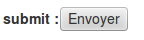

You can add a submit button like this

::

	$form->add('my-button', 'submit', $configuration);

Available configuration

============  ===================================  ======================  ===================================================
Property      Description                          Default value           Example
============  ===================================  ======================  ===================================================
style         css style for the html tag                                   width: 150px;
disabled      true if the html field is disabled   false                   true or false
title         html tag title                                               my field title
custom        custom html attribute                                        customattr="customvalue"
class         css class for the html tag                                   big
errorclass    css class when there is an error                             error
label         label of the button                                          click me!
============  ===================================  ======================  ===================================================

.. _elements-tel:

Tel
---

An input telephone field

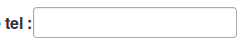

You can add a input tel like this

::

	$form->add('my-tel', 'tel', $configuration);

Available configuration

============  ===================================  ======================  =============================================================================================================
Property      Description                          Default value           Example
============  ===================================  ======================  =============================================================================================================
placeholder   place holder for the html tag                                Your telephone
style         css style for the html tag                                   width: 150px;
disabled      true if the html field is disabled   false                   true or false
title         html tag title                                               my field title
datalist      datalist for autocomplete                                    array('key-1' => 'value 1', 'key-2' => 'value 2')
custom        custom html attribute                                        customattr="customvalue"
class         css class for the html tag                                   big
errorclass    css class when there is an error                             error
pattern       regex for field control                                      ^((\+\d{1,3}(-| )?\(?\d\)?(-| )?\d{1,5})|(\(?\d{2,6}\)?))(-| )?(\d{3,4})(-| )?(\d{4})(( x| ext)\d{1,5}){0,1}$
============  ===================================  ======================  =============================================================================================================

.. _elements-text:

Text
----

An input text field

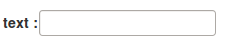

You can add a input text like this

::

	$form->add('my-text', 'text', $configuration);

Available configuration

============  ===================================  ======================  ===================================================
Property      Description                          Default value           Example
============  ===================================  ======================  ===================================================
placeholder   place holder for the html tag                                my firstname
style         css style for the html tag                                   width: 150px;
disabled      true if the html field is disabled   false                   true or false
title         html tag title                                               my field title
datalist      datalist for autocomplete                                    array('key-1' => 'value 1', 'key-2' => 'value 2')
custom        custom html attribute                                        customattr="customvalue"
class         css class for the html tag                                   big
errorclass    css class when there is an error                             error
============  ===================================  ======================  ===================================================

.. _elements-textarea:

Textarea
--------

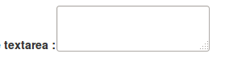

You can add a textarea like this

::

	$form->add('my-textarea', 'textarea', $configuration);

Available configuration

============  ===================================  ======================  ===================================================
Property      Description                          Default value           Example
============  ===================================  ======================  ===================================================
placeholder   place holder for the html tag                                my firstname
style         css style for the html tag                                   width: 150px;
title         html tag title                                               my field title
custom        custom html attribute                                        customattr="customvalue"
class         css class for the html tag                                   big
errorclass    css class when there is an error                             error
============  ===================================  ======================  ===================================================

.. _elements-upload:

Upload
------

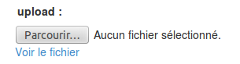

You can add a textarea like this

::

	$form->add('my-file', 'update', $configuration);

Available configuration

============  =====================================  ======================  ===================================================
Property      Description                            Default value           Example
============  =====================================  ======================  ===================================================
placeholder   place holder for the html tag                                  my firstname
style         css style for the html tag                                     width: 150px;
title         html tag title                                                 my field title
custom        custom html attribute                                          customattr="customvalue"
class         css class for the html tag                                     big
errorclass    css class when there is an error                               error
directory     target upload directory                                        fileadmin/user_upload/my_ext/
filename      target upload file name                                        my-file.pdf
canoverwrite  if true, overwrite existing file                               true or false
show_link     if true, display an link to the file                           true or false
============  =====================================  ======================  ===================================================

.. _elements-url:

Url
---

An input url field

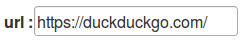

You can add a input url like this

::

	$form->add('my-url', 'url', $configuration);

Available configuration

============  ===================================  ======================  ===================================================
Property      Description                          Default value           Example
============  ===================================  ======================  ===================================================
placeholder   place holder for the html tag                                Your website
style         css style for the html tag                                   width: 150px;
disabled      true if the html field is disabled   false                   true or false
title         html tag title                                               my field title
datalist      datalist for autocomplete                                    array('key-1' => 'value 1', 'key-2' => 'value 2')
custom        custom html attribute                                        customattr="customvalue"
class         css class for the html tag                                   big
errorclass    css class when there is an error                             error
============  ===================================  ======================  ===================================================

.. _elements-custom

Custom
------

You can also create your own form element.

::
	
	$form->add('my-custom', 'Vendor\\Extension\\FormElements\\MyElement', $configuration)

Your php class must implement : 

::

	Ameos\AmeosForm\Elements\ElementInterface

